The Quad Zero Kit is a lightweight (<250g) platform with a 3D-printable frame, agile flying envelope and simple to setup. It is powered by our most popular flight controller yet, the Control Zero H7 OEM on top of custom made motors and a carrier board that includes power monitoring, integrated ESC module, Time-of-Flight sensor for precision landing (Z-axis), and additional ports to support any OSD, GPS, CAN, telemetry and any other payload peripherals.

We put together this guide to help you get up and running with your QZKit platform as fast as possible. Please note that this build may take anywhere from 3 hrs to several sessions depending on your particular experience.

## What's Included

Make sure you have all the parts listed below, if something is missing or you have any questions please do not hesitate to [contact us](mailto:help@mrobotics.io).

- [ ] Quad Zero Frame

- [ ] GPS Riser 
  
  - [ ] 4x 2-56x 3/16  Nylon socket head screws
  
  - [ ] 2x 2-56x 1/8  Nylon socket head screws

- [ ] 4x MI-2202
  
  - [ ] 8x M2x6mm black oxide screws.

- [ ] 2 Propeller set

- [ ] Quad Zero carrier board M10112E 
  
  - [ ] 3x MRC-0295 (MRC0243) JST-GH 6 to JST-SH 6 cables
  
  - [ ] BT2.0 pigtail
  
  - [ ] 2x ½”x½”x1/10” vibration dampers

- [ ] Control Zero OEM H7 M10059D autopilot
  
  - [ ] SD Card
  
  - [ ] Plastic tweezers

- [ ] SAM-M8Q Med size GPS M10038C 

- [ ] FrSky R-XSR radio receiver

- [ ] Quad Zero 2S 4200mAh battery 
  
  - [ ] XT60-BT2.0 adapter
  
  - [ ] Balance port adapter (JST-SH 3 to JST-XH 3)

- [ ] If you ordered the optional Dual-Band WiFi Telemetry Radio:
  
  - [ ] M10114C board
  
  - [ ] Molex Antenna (black rectangle with sticky back)
  
  - [ ] 1x MRC-0291 JST-SH 4 short cable
  
  - [ ] 1x MRC-0292 JST-SH 6  short cable

## Required tools

- [ ] M1.5 hex driver

- [ ] M2 hex driver

- [ ] Hobby knife

- [ ] CA glue 
  
  - [ ] Accelerator - optional

- [ ] Soldering iron
  
  - [ ] Solder wire

- [ ] Double-sided tape - 3M VHB recommended

- [ ] Prop balancer - optional

- [ ] Scissors - optional

## Extra resources

- [ ] FrSky D16 protocol compatible transmitter

- [ ] Ground station hardware - your laptop or a tablet running Mission Planner or QGC

# Step 1 - Attach motors to the frame

### Materials Needed:

- 12x M2x5mm screws (included inside the motors)

- 4x MI-2202 brushless motors

Take one MI-2202 brushless motor from its box, make sure the rotor can spin freely and screw it in place with 3 previously allocated M2x5mm hex screws with your M1.5 hex driver.

**NOTE**: Make sure the motor's wires point down the frame's arm. See figure below.

Please do not use Loctite or other similar fluids as these may damage the plastic integrity over time. Repeat the above steps for the remaining 3 arms. Due to the nature of the manufacturing process, your frame may or may not have 'elephant foot' artifacts; if this is the case please remove them using a hobby knife.

Once you finish placing and screwing all the motors your frame should look something like the picture below.

# Step 2 - Carrier board subassembly

### Radio RX wire prep

**NOTE:** We cannot guarantee the firmware version that FrSky or our distributor ship the receivers with, we understand this situation is not optimal for ease of use and are currently working to solve it. 

*We chose the R-XSR receiver for its flexibility and low weight. Depending on your particular needs you may choose to place it in a different location or not use one at all.  In this guide we will cover the standard RC receiver placed on the side of the frame.*

The receiver comes with two cable harnesses. Put away the one with the JR connector as you may use it to flash firmware from the transmitter.

Locate the harness with pre-tinned pigtails and remove the white and yellow wires using some tweezers or hobby knife to pop up the latch of the connector housing.

Make sure your connector assembly looks like the picture below. This shows a standard SBUS out connection to the FC, however if you are an advanced user and would like to use the S.Port for telemetry you may adapt these instructions as needed.

Then, for an appropriate cable management cut the wire length to 26mm or about an inch from the connector housing. Again, if you require to place your radio elsewhere feel free to do so.
Now, cut a piece of double sided tape and put in on the antenna connector side of the board, if the tape is too thin you may stack up 2 or more layers, as needed to get a good flat surface area so it sticks better to the frame. Do not place it yet.

Next, solder the pigtails to the carrier board as described below.

| Color | Carrier pad        |
| ----- | ------------------ |
| Black | GND                |
| Red   | RCV_SEL |
| Green | RCIN    |

**NOTE:** If you are using a Spektrum satellite receiver please visit the M10112 carrier board wiki for directions on how to change the voltage and pairing logic.

## Carrier board prep

### Connect ESC signal cable

Grab the colorful JST-SH 6 to JST-SH 6 cableA]

[INSERT IMAGE HERE]

### Remove ToF sensor protective cover

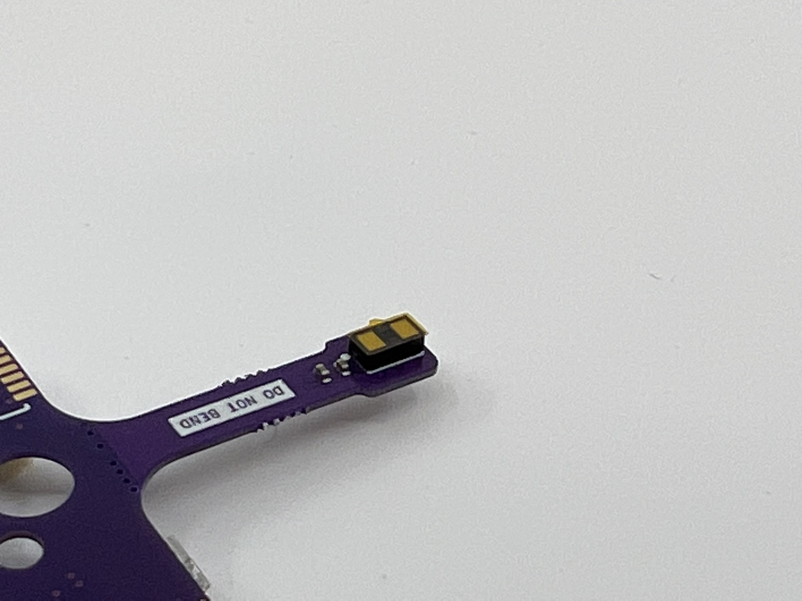

### Vibration dampers

Cut the provided vibration dampening material by half so you end up with 4 small pieces, to do so you may use a hobby knife or scissors.

Remove the plastic cover on one square and place a small drop of CA glue in the center of any square on the carrier board's back side. Press the square firmly for 10 seconds or until the square no longer slides on the surface.

Repeat for the rest of the corners.

### Secure in place

Place the carrier board on its back and remove the remaining damping material adhesive cover.

Add a CA drop on top of each dampening square.

Mount the carrier board onto the frame using the *tabs and the side holes* to align the carrier assembly. You won't see the tabs in the GIF below, but we changed the steps order so the alignment is easier.

Press firmly for 30 seconds or until CA has tacked.

### Remove break away tabs

To remove the tabs you may use any tweezers or bare fingers. Apply a torque or twisting force carefully along the axis of the dotted line, otherwise you may damage the internal layer stackup of the board.

# Step 3 - Soldering

## Battery connector

Solder the BT2.0 pigtail onto the battery terminals of the M10112 carrier board. The red wire should match the **'+'** sign in the board. 

## Motors

Cut the motor cable in order to reach the carrier board's motor pads, our small trick to get the wire length correct consists in pulling the wires above the carrier and cut arpund 5-6mm from the edge of the board. Then strip 3-4mm and pre-tin the ends.

Don't worry for the motor directions at this point, we will verify that using software at a later time. However if you pay attention to detail, you may skip a step later if you solder the front right [A] and rear left [C] motor wires straight (as-is) and swapping any two out of the three wires for the front left [D] and rear right [B] motors. **Note:** Letters in brackets refer to the corresponding motor as labeled in the carrier board pads.

### Motor cable management

This is a recommended step which may be completed with a couple of techniques. In previous versions of this guide we recommended using SuperX glue, however the CA method is faster and cheaper. However using a zip tie, hot glue or similar materials is enough. The goal is to mitigate the vibrations from the cables freely moving under the prop wash and prevent prop strikes.

Once you have all the motors soldered, gently pull the cables from the motor towards the center of the frame and apply a generous drop of CA glue at two thirds of the arm's length, making sure it covers the cables. Then apply CA accelerator and wait for it to tack.

Check the following pictures for details.

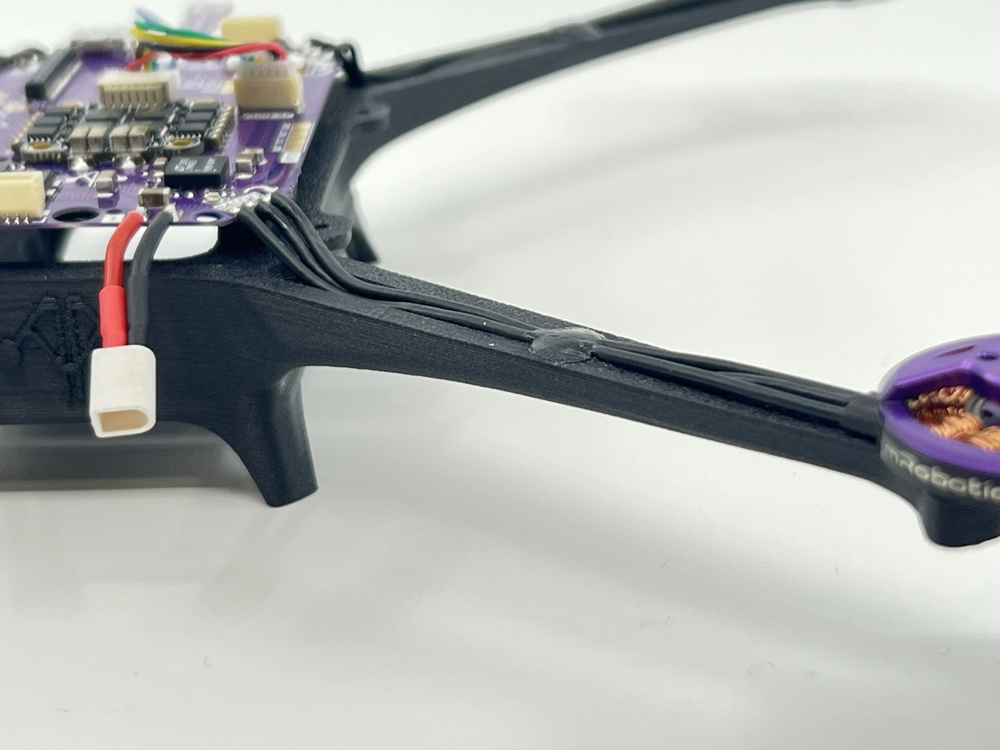

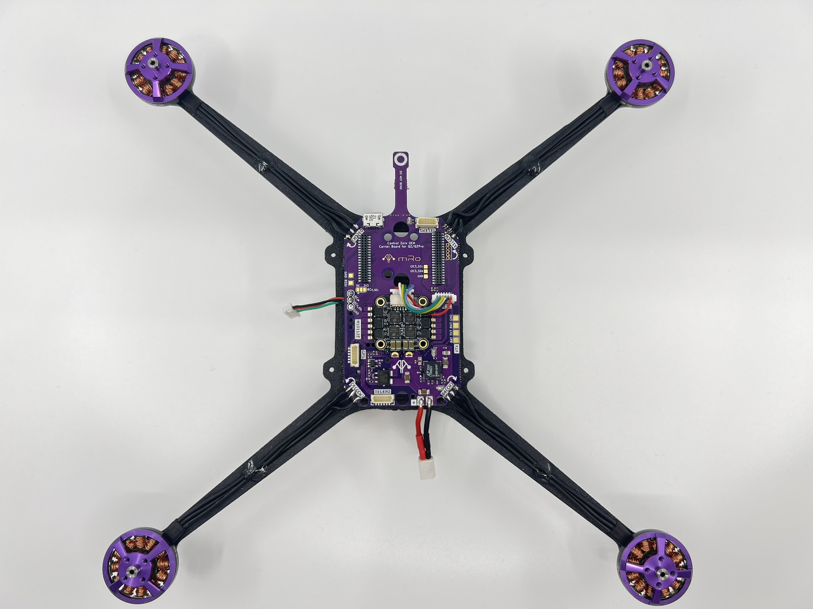

# 

# Step 4 - RF subassembly

You may put the frame assembly on the side for the next couple of steps.

### DualBand Telemetry radio

We will start this section by opening the bag that contains the Dual Band telemetry radio. Please handle with care and take ESD protection measures, be particularly rigurous on this if you live in a very dry area.

Allocate the GPS Riser and grab the two 2-56x1/8" nylon hex screws to attach the M10114 Dual Band telemetry radio board to the plastic riser as pictured below.

If you are not using the Wifi telemetry radio, you may place any other type of telemetry radio, always taking into account the interference this may cause to the GPS receiver.

Connect each of the DualBand telemetry radio antenna cables to a u.Fl connector on the wifi module.

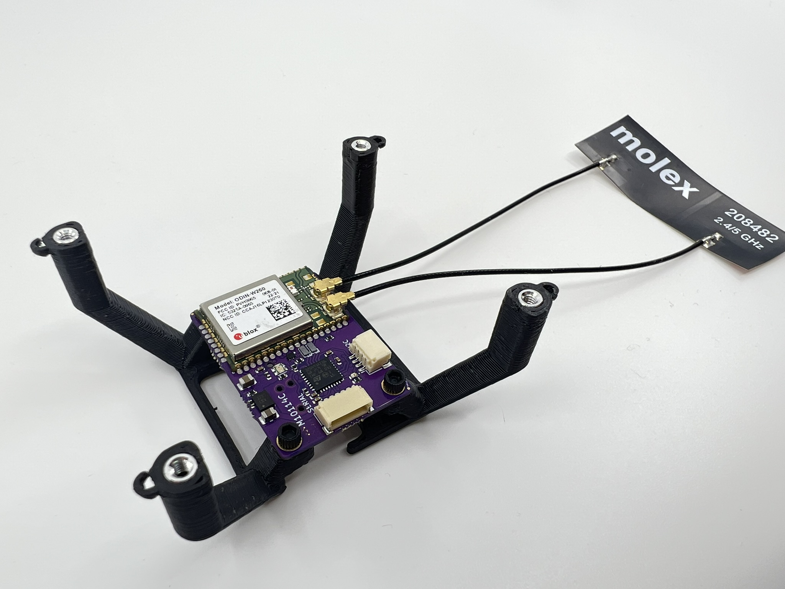

### GPS Receiver

Place a small 9x9mm double sided tape square and place the GPS on top. We recommend to put smaller squares to increase the contact area, however we have found that the small square is enough.

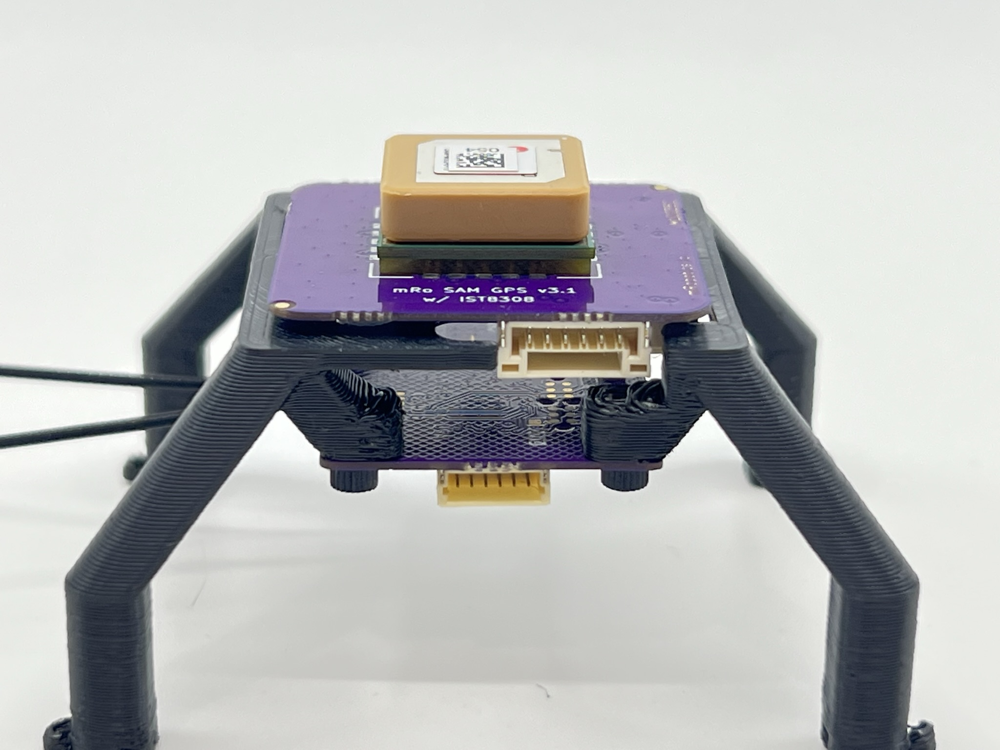

## Install autopilot board in place

Remove the Control Zero H7 OEM autopilot from its anti-static packaging taking the same precautions as in the previous step.

Place it with the arrow pointing to the left  side of the carrier board, the ToF sensor protrusion is the front direction. There is only one way to couple the FC board to the carrier, since the front header has 36 pins and the rear header has 40 pins.

If for any reason you need to remove the Control Zero board, you may do so with the included plastic tweezers, using them as a lever to gently separate each connector 1-2mm at a time.

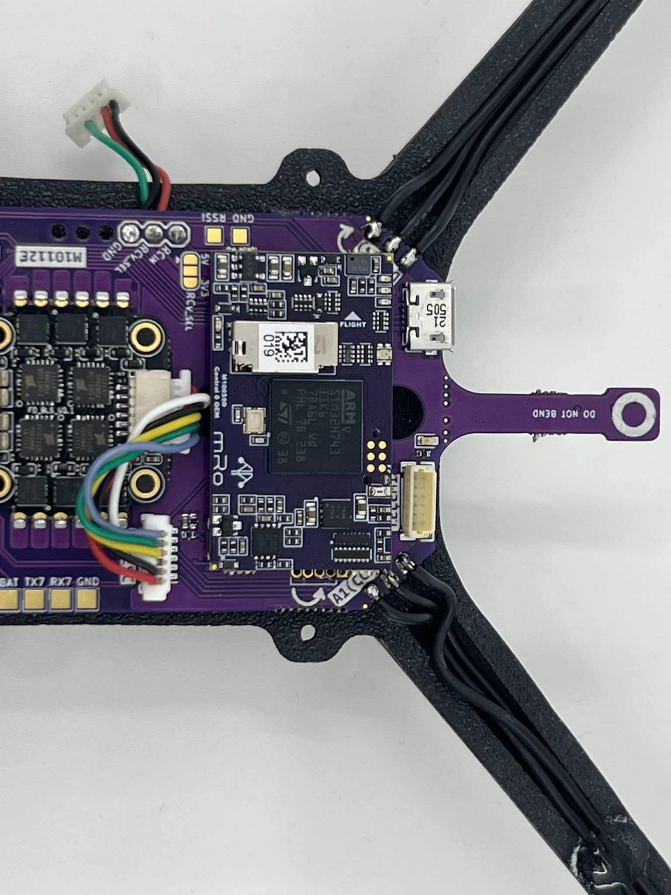

### Secure RF subassembly to frame

Gently bend the antenna cables 180 degrees so you are able to place it on the right side of the frame. We suggest securing the GPS riser in place before glueing the antenna. To do so, use 4x 2-56x3/16" nylon hex screws.

See picture below for reference. Use CA glue to strengthen the bond as needed.

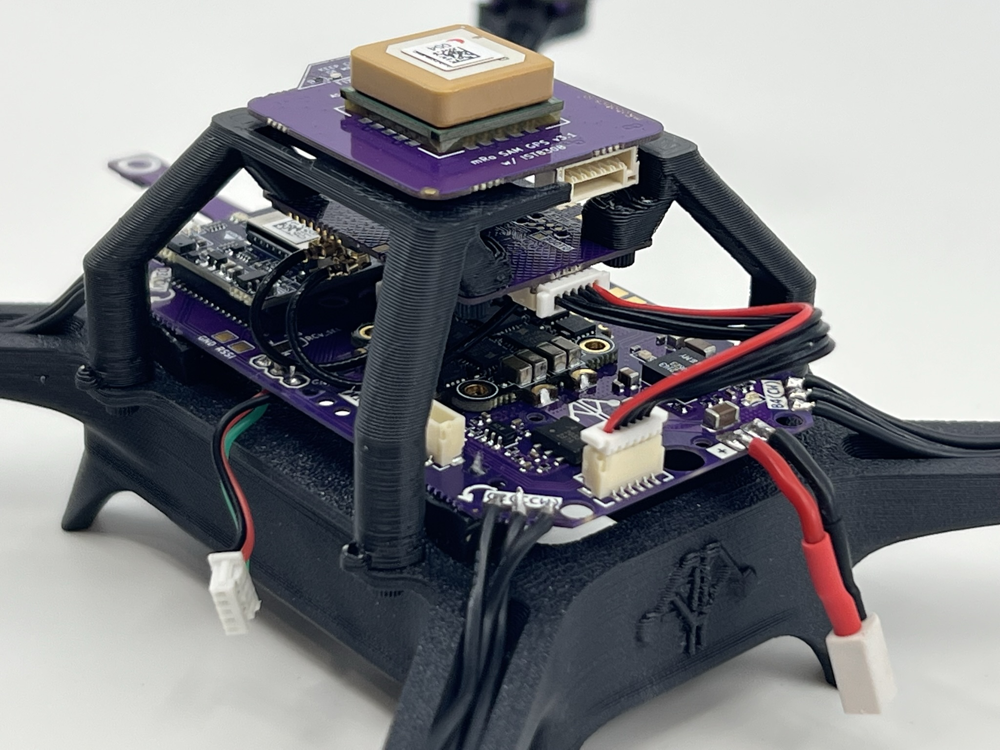

### Cable management

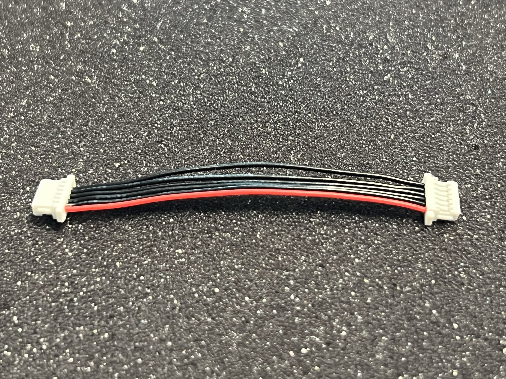

Take one MRC-0292 JST-SH 6-pin to JST-SH 6-pin cable and connect it to the SERIAL labeled connector of the M10114 board (telemetry), then connect it to the TELEM2 port of M10112 carrier board. Check the previous picture for reference.

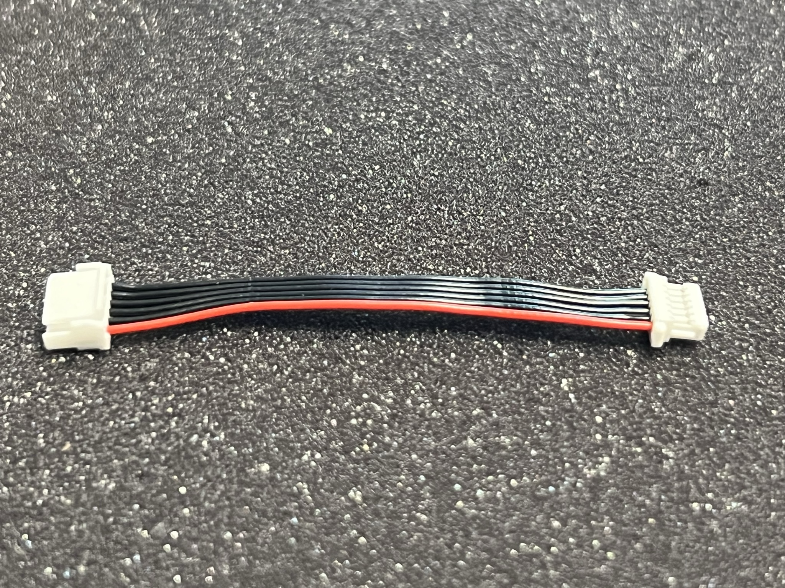

You may push the extra cable between both boards, making sure not to bend them aggressively.

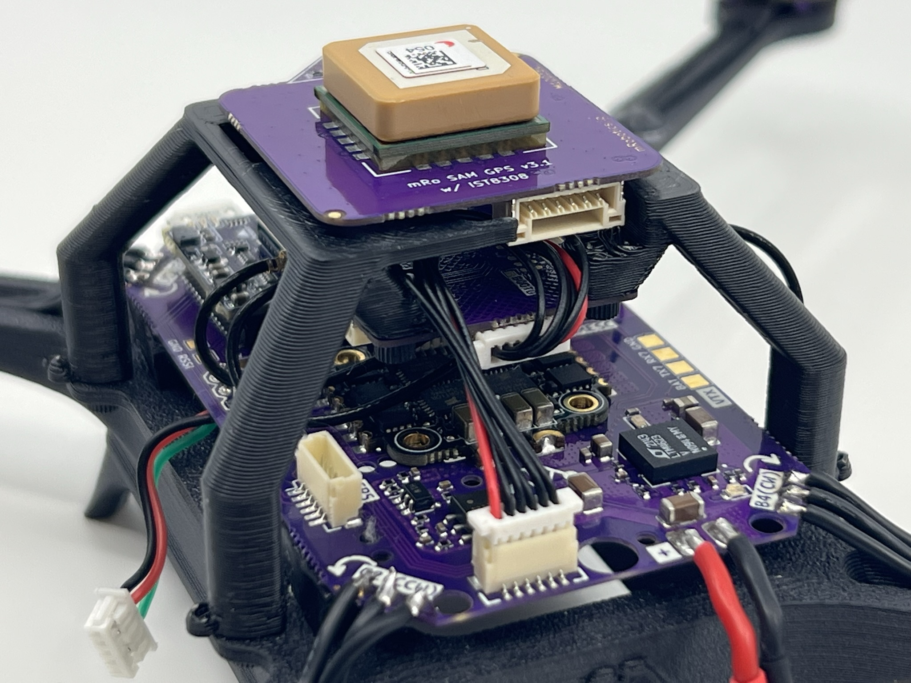

Then take one MRC-0243 JST-SH 6-pin to JST-GH 6-pin cable, connect the GH end to the GPS Receiver board and rout it through TELEM2 and between GPS and telemetry radio cable, then pull connector from the left side to connect it in the GPS labeled connector on the carrier. 

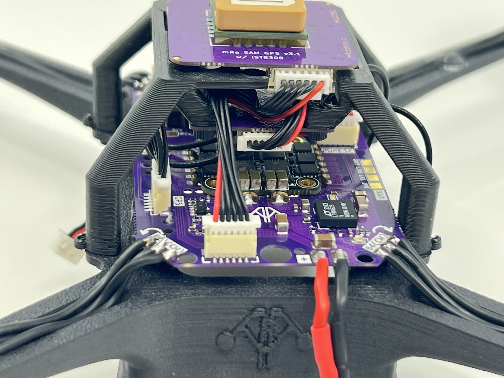

### Radio RX placement and antenna routing

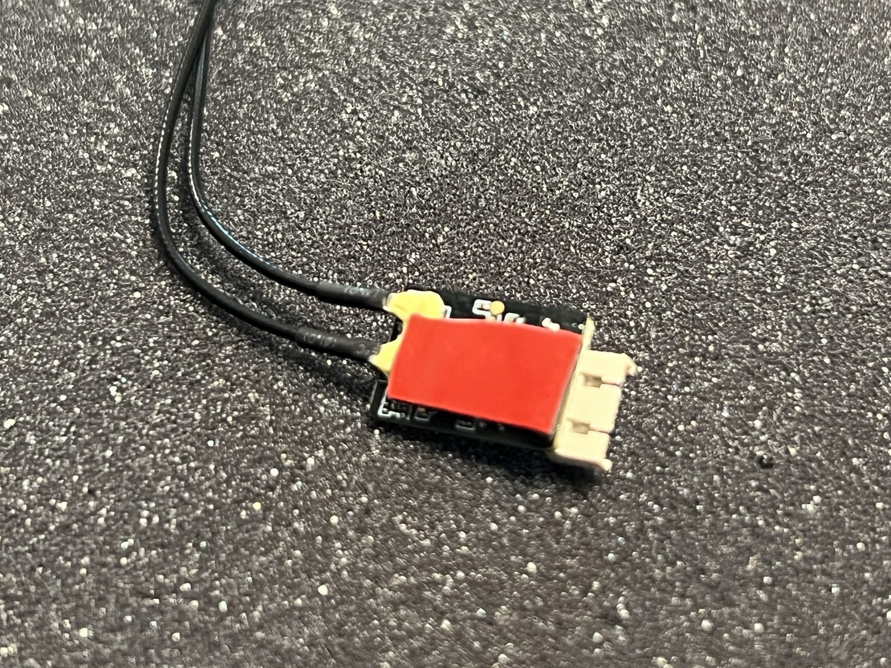

If you haven't already, place a small double sided tape square on the antenna side of the R-XSR radio receiver. Connect its pre-soldered cable assembly, remove the adhesive protection and press firmly for 30 seconds. You may add CA glue to increase the bond strength.

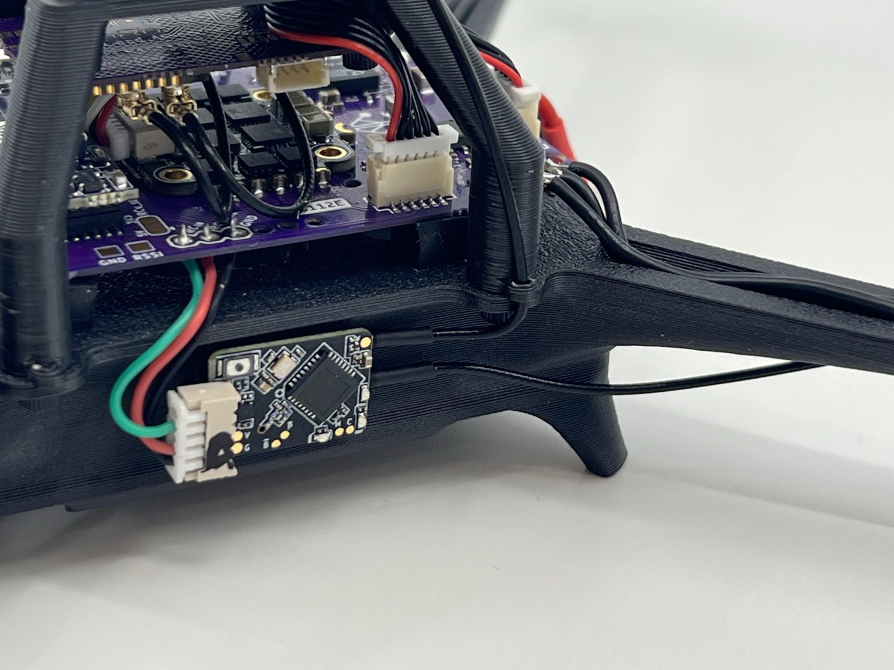

Note the suggested antenna placement. Feel free to change the routing according to your payload. We used the CA glue blob method to fix the antennas to the frame. 

# Step 5 - FC Configuration

You will have to evaluate which flight stack you will be running in your QZKit. The mRo Control Zero H7 OEM is supported by [Ardupilot](https://ardupilot.org) and [PX4](https://px4.io/), both broadly capable and stable open source projects. We provide instructions for **both** platforms with a minimum set of directions and parameter files. 

## Ardupilot

The mRo Control Zero H7 OEM board comes with Ardupilot flashed out of the box. Connect your carrier board to any computer running [Mission Planner](https://ardupilot.org/planner/) software and update to the latest stable version, AC4.3.3 at the time of writing. Please follow [this](https://ardupilot.org/copter/docs/common-loading-firmware-onto-pixhawk.html) guide if you need further details.

### Parameter list

After updating the firmware, connect via MAVLink using 115200 as baud rate value, this setting is located on the top right corner of any screen in MP software, then click on the *Settings* tab.

Click the *Load Parameters* button and select [this]() parameter file which should be in your Downloads folder.

Allow once you press OK button (reboot prompt) wait until the beep
Parameters succesfully saved
Should reconnect auto, if not just press disconnect and Connect .

## PX4

Even if our board ship with Ardupilot out of the box it doesn't mean using PX4 is an advanced or complicated task. Fortunately both projects offer a common bootloader behavior which will be recognized by either software. Please do not attempt to change the bootloader. The steps to load PX4 onto the Control Zero OEM H7 board are the following:

1. Open QGroundControl software. Leave the carrier board unconnected.

2. Click on the upper left corner (QGC logo), then click the *Vehicle Setup* button.

3. You should see that there are only two tabs on the left pane: *Summary* and *Firmware*. No hardware should be connected at this point!

4. Click on the *Firmware* button and proceed to connect your board.

5. Select the branch or firmware flavor you need to upload. Note that you can choose either PX4 Pro or Ardupilot software from the menu. If you check the *Advanced settings* box you may select to upload any other binary.

6. Wait until the writing and verification process ends. The board will reboot and it will start beeping afterwards.

7. You may now connect to it as usual from the QGC comms pane.

### Parameters file

When selecting vehicle type, click on the dropdown menu for *Quadrotor x* and select mRo QZ Kit. This will load all the appropriate parameters for your vehicle.

## Sensor calibration, RC setup and motor direction check

Regardless of the flight stack you are running, you **<u>must</u>** perform these calibration steps to ensure a completely configured platform. 

For Ardupilot:

- [Accelerometer Calibration — Copter documentation](https://ardupilot.org/copter/docs/common-accelerometer-calibration.html)

- [Compass Calibration &mdash; Copter documentation](https://ardupilot.org/copter/docs/common-compass-calibration-in-mission-planner.html)

- [Radio Control Calibration &mdash; Copter documentation](https://ardupilot.org/copter/docs/common-radio-control-calibration.html)

- [RC Transmitter Flight Mode Configuration &mdash; Copter documentation](https://ardupilot.org/copter/docs/common-rc-transmitter-flight-mode-configuration.html)

- [Connect ESCs and Motors &mdash; Copter documentation](https://ardupilot.org/copter/docs/connect-escs-and-motors.html#connect-escs-and-motors) - Use "motor test" to verify the correct order and motor spin direction.

For PX4:

- [Compass Calibration | PX4 User Guide](https://docs.px4.io/main/en/config/compass.html)

- [Accelerometer | PX4 User Guide](https://docs.px4.io/main/en/config/accelerometer.html)

- [Radio (Remote Control) Setup | PX4 User Guide](https://docs.px4.io/main/en/config/radio.html)

- [Flight Mode Configuration | PX4 User Guide](https://docs.px4.io/main/en/config/flight_mode.html)

- [Actuator Configuration and Testing | PX4 User Guide](https://docs.px4.io/main/en/config/actuators.html) - Use the manual output sliders to verify correct order and spin direction.

**NOTE:** Motor spin direction reference is the same for both flight stacks, if any doubts arise please double check with the printed arrows in the carrier board.

# Final assembly steps

## Props & motors subassembly

Before installing the propellers, we strongly advise to balance them statically. Even if manufacturers label the props as pre-balanced you should double and triple check this fact experimentally using a propeller balancer tool.

### Install propellers

Use 2 included M2x5mm screws per motor to secure the propeller in place. Loctite is allowed for extra security. Ensure the propellers are mounted correctly according to the first picture on this guide.

### Dynamic balancing

**NOTE:** *This step involves running the motors with the propellers on the bench, if you do not feel comfortable doing so there are alternative ways of achieveing the same results. We highly recommend doing this step if you want the best performance from your Quad Zero Kit, motors will run quieter and cooler and the estimators will be much happier when the autopilot is not vibrating violently from a poorly balanced motor-prop assembly. We would like to do this step for you to guarantee the best experience out of the box, however it is time-consuming and it would require a strict labeling for positioning the propellers on the motors thus bringing an increase in lead times and price.*

If using Ardupilot ...

# Fly responsibly, safely and securly.

Happy flying!
